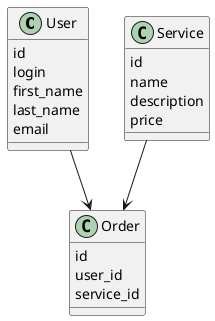

# Компонентная архитектура

## Компонентная диаграмма

```plantuml
@startuml
!include https://raw.githubusercontent.com/plantuml-stdlib/C4-PlantUML/master/C4_Container.puml

Person(user, "Пользователь")
System_Ext(web_app, "Веб-приложение", "HTML, CSS, JavaScript", "Веб-интерфейс")
System(service, "Сервис заказа услуг", "Java", "API для работы с пользователями, услугами и заказами")
SystemDb(database, "База данных", "MySQL", "Хранение данных о пользователях, услугах и заказах")

Rel(user, web_app, "Использует")
Rel(web_app, service, "Вызывает API")
Rel(service, database, "INSERT/SELECT/UPDATE", "SQL")

@enduml
```

## Список компонентов

### Сервис заказа услуг
**API**:
- Создание нового пользователя
  - Входные параметры: логин, пароль, имя, фамилия, email
  - Выходные параметры: идентификатор пользователя
- Поиск пользователя по логину
  - Входные параметры: логин
  - Выходные параметры: идентификатор пользователя, имя, фамилия, email
- Поиск пользователя по маске имени и фамилии
  - Входные параметры: маска имени, маска фамилии
  - Выходные параметры: массив пользователей (идентификатор, имя, фамилия, email)
- Создание услуги
  - Входные параметры: название услуги, описание, стоимость
  - Выходные параметры: идентификатор услуги
- Получение списка услуг
  - Входные параметры: отсутствуют
  - Выходные параметры: массив услуг (идентификатор, название, описание, стоимость)
- Добавление услуги в заказ
  - Входные параметры: идентификатор пользователя, идентификатор услуги
  - Выходные параметры: отсутствуют
- Получение заказа для пользователя
  - Входные параметры: идентификатор пользователя
  - Выходные параметры: массив заказов (идентификатор, идентификатор пользователя, идентификатор услуги)

### Модель данных
