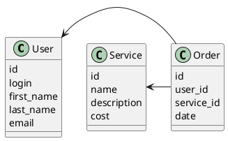

# Компонентная архитектура
## Компонентная диаграмма

```plantuml
@startuml
!include https://raw.githubusercontent.com/plantuml-stdlib/C4-PlantUML/master/C4_Container.puml

AddElementTag("microService", $shape=EightSidedShape(), $bgColor="CornflowerBlue", $fontColor="white", $legendText="microservice")
AddElementTag("storage", $shape=RoundedBoxShape(), $bgColor="lightSkyBlue", $fontColor="white")

Person(admin, "Администратор")
Person(user, "Пользователь")

System_Ext(web_site, "Клиентский веб-сайт", "HTML, CSS, JavaScript, React", "Веб-интерфейс")

System_Boundary(service_order_site, "Сайт заказа услуг") {
   Container(user_service, "Сервис пользователей", "C++", "Сервис управления пользователями", $tags = "microService")    
   Container(service_service, "Сервис услуг", "C++", "Сервис управления услугами", $tags = "microService") 
   Container(order_service, "Сервис заказов", "C++", "Сервис управления заказами", $tags = "microService")   
   ContainerDb(db, "База данных", "MySQL", "Хранение данных о пользователях, услугах и заказах", $tags = "storage")
   
}

Rel(admin, web_site, "Просмотр, добавление и редактирование информации о пользователях, услугах и заказах")
Rel(user, web_site, "Регистрация, просмотр информации о услугах и заказах и создание заказов")

Rel(web_site, user_service, "Работа с пользователями", "localhost/user")
Rel(user_service, db, "INSERT/SELECT/UPDATE", "SQL")

Rel(web_site, service_service, "Работа с услугами", "localhost/service")
Rel(service_service, db, "INSERT/SELECT/UPDATE", "SQL")

Rel(web_site, order_service, "Работа с заказами", "localhost/order")
Rel(order_service, db, "INSERT/SELECT/UPDATE", "SQL")

@enduml
```
## Список компонентов  

### Сервис пользователей
**API**:
-	Создание нового пользователя
      - входные параметры: login, пароль, имя, фамилия, email
      - выходные параметры: отсутствуют
-	Поиск пользователя по логину
     - входные параметры:  login
     - выходные параметры: имя, фамилия, email
-	Поиск пользователя по маске имени и фамилии
     - входные параметры: маска фамилии, маска имени
     - выходные параметры: login, имя, фамилия, email

### Сервис услуг
**API**:
- Создание услуги
  - Входные параметры: название услуги, описание, стоимость
  - Выходыне параметры: идентификатор услуги
- Получение списка всех услуг
  - Входные параметры: отсутствуют
  - Выходные параметры: массив с услугами, где для каждой указаны её идентификатор, название, описание, стоимость

### Сервис заказов
**API**:
- Создание заказа
  - Входные параметры: пользователь, список услуг, дата создания
  - Выходные параметры: идентификатор заказа
- Получение заказа для пользователя
  - Входные параметры: пользователь
  - Выходные параметры: массив с заказами (идентификатор, пользователь, список услуг, дата создания)

### Модель данных

